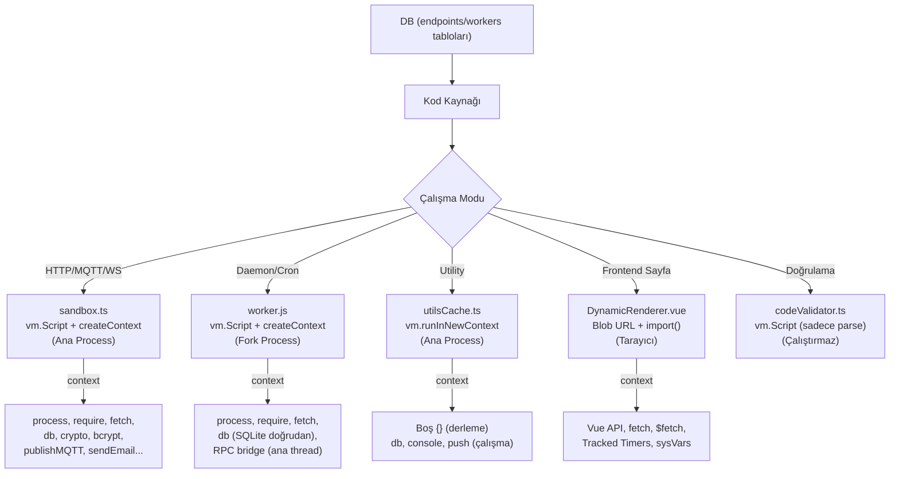

# IIoT Platform — Dinamik Kod Çalıştırma Audit Raporu

> **Tarih:** 2026-07-26  
> **Kapsam:** Proje genelinde dinamik kod çalıştırma mekanizmalarının tespiti ve analizi  
> **Not:** AGENTS.md kurallarına uygun olarak bu rapor yalnızca bir **audit**'tir. Hiçbir dosyada değişiklik yapılmamıştır.

---

## 1. Yönetici Özeti

Projede **5 farklı mekanizma** ile dinamik kod çalıştırma yapılmaktadır:

| Mekanizma | Dosya(lar) | Çalışma Ortamı |
|-----------|------------|-----------------|
| `vm.Script` + `vm.createContext` | [sandbox.ts](file:///C:/Users/murat/Desktop/iiotplatform/server/utils/sandbox.ts) | Server (ana process) |
| `vm.Script` + `vm.createContext` | [worker.js](file:///C:/Users/murat/Desktop/iiotplatform/server/utils/worker.js) | Server (fork'lanmış child process) |
| `vm.runInNewContext` | [utilsCache.ts](file:///C:/Users/murat/Desktop/iiotplatform/server/utils/utilsCache.ts) | Server (ana process) |
| `vm.Script` (sadece sözdizimi doğrulama) | [codeValidator.ts](file:///C:/Users/murat/Desktop/iiotplatform/server/utils/codeValidator.ts) | Server (ana process) |
| `Blob URL` + dynamic `import()` | [DynamicRenderer.vue](file:///C:/Users/murat/Desktop/iiotplatform/app/components/DynamicRenderer.vue) | Client (tarayıcı) |

---

## 2. Detaylı Dosya Analizi

---

### 2.1 `sandbox.ts` — Ana Sandbox Motoru

**Dosya:** [sandbox.ts](file:///C:/Users/murat/Desktop/iiotplatform/server/utils/sandbox.ts)  
**Satırlar:** 462

Bu dosya, platformun kalbi olan `runCustomCode()` fonksiyonunu barındırır. DB'den gelen kullanıcı kodu burada `vm.Script` ile derlenir ve `vm.createContext` ile izole bir context'te çalıştırılır.

#### Çalışma Akışı

1. Kullanıcı kodu `vm.Script` ile derlenir ([satır 182-194](file:///C:/Users/murat/Desktop/iiotplatform/server/utils/sandbox.ts#L182-L194))
2. `vm.createContext()` ile izole bir sandbox context oluşturulur ([satır 402](file:///C:/Users/murat/Desktop/iiotplatform/server/utils/sandbox.ts#L402))
3. `script.runInContext(context, { timeout })` ile çalıştırılır ([satır 404](file:///C:/Users/murat/Desktop/iiotplatform/server/utils/sandbox.ts#L404))

#### Tespit Edilen Sorunlar

> [!WARNING]
> **S1 — `process` Objesi Sandbox'a Doğrudan Veriliyor**
> 
> [Satır 320](file:///C:/Users/murat/Desktop/iiotplatform/server/utils/sandbox.ts#L320): `process` objesi filtrelenmeden sandbox context'ine enjekte ediliyor.
> 
> **Etki:** Sandbox içinde yazılan kod `process.exit()`, `process.kill()`, `process.env` (okuma/yazma), `process.memoryUsage()`, `process.cpuUsage()` gibi tüm process API'lerine erişebilir.
> 
> **Mimari Not:** AGENTS.md'ye göre bu tek-geliştirici bir ortam olduğundan, bu kasıtlı bir tasarım kararı olabilir. Ancak `process.exit(0)` çağrısı tüm sunucuyu çökertir.

> [!WARNING]
> **S2 — `require` Fonksiyonu Sandbox'a Veriliyor (Sınırsız Modül Yükleme)**
>
> [Satır 322](file:///C:/Users/murat/Desktop/iiotplatform/server/utils/sandbox.ts#L322): `customRequire` fonksiyonu sandbox'a verilmiş. Bu fonksiyon önce `plugins/` dizininde, sonra `node_modules/` dizininde modül arar.
>
> **Etki:** Sandbox kodu `require('fs')`, `require('child_process')`, `require('net')` gibi Node.js native modüllerinin tamamına erişebilir. Yorum satırında ([satır 160](file:///C:/Users/murat/Desktop/iiotplatform/server/utils/sandbox.ts#L160)) bu kasıtlı olarak belirtilmiştir: *"fs ve child_process için require desteği"*.
>
> **Mimari Not:** Bu "On-Premise" felsefesiyle tutarlıdır, ancak bir sandbox'ın amacı olan izolasyonu fiilen ortadan kaldırır.

> [!IMPORTANT]
> **S3 — Senkron Timeout ile Asenkron Timeout Arasında Potansiyel Yarış Durumu**
>
> VM'nin native `timeout` parametresi ([satır 404](file:///C:/Users/murat/Desktop/iiotplatform/server/utils/sandbox.ts#L404)) yalnızca **senkron** sonsuz döngüleri yakalar. Asenkron işlemler için ayrı bir `Promise.race` timeout'u ([satır 408-414](file:///C:/Users/murat/Desktop/iiotplatform/server/utils/sandbox.ts#L408-L414)) uygulanmış.
>
> **Sorun:** Promise.race timeout tetiklendiğinde, `abortController.abort()` çağrılır ancak bu yalnızca `fetch` ve `sleep` işlemlerini iptal eder. Sandbox içinden başlatılan `require('child_process').exec()` gibi çağrılar iptal **edilemez** ve zombie process olarak kalır.

> [!NOTE]
> **S4 — LRU Cache ile Script Derleme Önbelleği**
>
> [Satır 55](file:///C:/Users/murat/Desktop/iiotplatform/server/utils/sandbox.ts#L55): Derlenmiş `vm.Script` nesneleri `LRUCache<string, vm.Script>({ max: 1000 })` ile önbelleğe alınıyor.
>
> **Olumlu:** Aynı kodun tekrar derlenmesini önler. Cache invalidation [satır 454-461](file:///C:/Users/murat/Desktop/iiotplatform/server/utils/sandbox.ts#L454-L461)'de mevcut.
>
> **Not:** Cache key olarak `${tenantSlug}_${sourceId}` kullanılıyor. Kod değiştiğinde cache otomatik olarak temizlenmiyor — ancak `clearSandboxCache()` fonksiyonu mevcut.

---

### 2.2 `worker.js` — İzole Worker Process

**Dosya:** [worker.js](file:///C:/Users/murat/Desktop/iiotplatform/server/utils/worker.js)  
**Satırlar:** 247

Daemon servisleri ve cron işleri için kullanılan child process dosyası. `fork()` ile başlatılır.

#### Tespit Edilen Sorunlar

> [!WARNING]
> **S5 — Worker Context'ine `process` Objesi Doğrudan Veriliyor**
>
> [Satır 192](file:///C:/Users/murat/Desktop/iiotplatform/server/utils/worker.js#L192): `process` objesi worker sandbox'a doğrudan enjekte ediliyor. Sandbox kodu `process.exit()` çağrarak worker'ı sonlandırabilir (ancak auto-restart mekanizması bunu telafi eder).

> [!WARNING]
> **S6 — Worker Context'ine `require` (customRequire) Veriliyor**
>
> [Satır 194](file:///C:/Users/murat/Desktop/iiotplatform/server/utils/worker.js#L194): sandbox.ts ile aynı yapıda `customRequire` fonksiyonu verilmiş. Worker kodu tüm Node.js modüllerine erişebilir.

> [!NOTE]
> **S7 — Worker'da VM Timeout Yok**
>
> [Satır 226-227](file:///C:/Users/murat/Desktop/iiotplatform/server/utils/worker.js#L226-L227): `vm.Script` çalıştırılırken `timeout` parametresi kullanılmıyor. Sonsuz senkron döngüler worker process'i sonsuza kadar bloke edebilir.
>
> **Hafifletici Faktör:** Worker process `--max-old-space-size=50` ile başlatılıyor ([workerManager.ts satır 190](file:///C:/Users/murat/Desktop/iiotplatform/server/utils/workerManager.ts#L190)), bu da OOM ile zorla çıkışı tetikler. Ayrıca cron worker'ları için 60 saniyelik hard timeout mevcut ([workerManager.ts satır 790-797](file:///C:/Users/murat/Desktop/iiotplatform/server/utils/workerManager.ts#L790-L797)).

> [!IMPORTANT]
> **S8 — Worker Kodu DB'den Doğrudan Çekilip Çalıştırılıyor**
>
> [workerManager.ts satır 184](file:///C:/Users/murat/Desktop/iiotplatform/server/utils/workerManager.ts#L184): Worker kodu doğrudan DB'den `SELECT code FROM workers WHERE id = ?` ile çekilip `worker.js`'e gönderiliyor. Herhangi bir `codeValidator` doğrulaması yapılmıyor.
>
> **Mimari Not:** `test-run.post.ts` dosyasında test çalıştırmadan önce `validateJS()` çağrılıyor ([satır 26-29](file:///C:/Users/murat/Desktop/iiotplatform/server/api/admin/sandbox/test-run.post.ts#L26-L29)), ancak gerçek çalıştırmada (startDaemonWorker) bu doğrulama bypass ediliyor.

---

### 2.3 `utilsCache.ts` — Utility Derleme Motoru

**Dosya:** [utilsCache.ts](file:///C:/Users/murat/Desktop/iiotplatform/server/utils/utilsCache.ts)  
**Satırlar:** 237

DB'den yüklenen "utility" fonksiyonlarını `vm.runInNewContext` ile derler.

#### Tespit Edilen Sorunlar

> [!IMPORTANT]
> **S9 — Yasak Kelime Kontrolü Regex ile Yapılıyor (Kolay Bypass)**
>
> [Satır 122-129](file:///C:/Users/murat/Desktop/iiotplatform/server/utils/utilsCache.ts#L122-L129): `eval`, `Function`, `globalThis`, `global`, `import` kelimeleri regex ile aranıyor. Ancak bu kontrol kolayca bypass edilebilir:
> ```javascript
> const e = window['ev' + 'al']; // Regex bunu yakalayamaz
> const g = globalThis; // Kelime sınırı (\b) ile yakalanır, ancak:
> const fn = Reflect.construct(Function, ['return 1']); // "Function" yakalanır ama "Reflect" yakalanmaz
> ```
>
> **Hafifletici Faktör:** `vm.runInNewContext(wrappedCall, {})` çağrısında boş bir context (`{}`) kullanılıyor, bu da `eval`, `globalThis` gibi globallerin zaten mevcut olmadığı anlamına gelir. Regex kontrolü bu durumda gereksiz bir ek güvenlik katmanıdır.

> [!NOTE]
> **S10 — `vm.runInNewContext` ile Boş Context**
>
> [Satır 152, 176, 199](file:///C:/Users/murat/Desktop/iiotplatform/server/utils/utilsCache.ts#L152): Utility fonksiyonları `vm.runInNewContext(wrappedCall, {})` ile boş context'te derleniyor. Bu, sandbox.ts'ten farklı olarak daha kısıtlı bir ortam sağlar — `process`, `require`, `fetch` gibi API'ler mevcut değildir.
>
> **Ancak:** Derlenen fonksiyon daha sonra `executeUtility()` ([satır 209-236](file:///C:/Users/murat/Desktop/iiotplatform/server/utils/utilsCache.ts#L209-L236)) ile çağrıldığında, ona `context` parametresi ile `db`, `console`, `push` gibi API'ler verilir. Utility kodu doğrudan `db.unsafe()` ile SQL çalıştırabilir.

---

### 2.4 `codeValidator.ts` — Sözdizimi Doğrulayıcı

**Dosya:** [codeValidator.ts](file:///C:/Users/murat/Desktop/iiotplatform/server/utils/codeValidator.ts)  
**Satırlar:** 194

#### Değerlendirme

> [!NOTE]
> **Güvenli Kullanım**
>
> Bu dosyada `vm.Script` yalnızca **sözdizimi doğrulama** amacıyla kullanılıyor ([satır 49](file:///C:/Users/murat/Desktop/iiotplatform/server/utils/codeValidator.ts#L49)). Kod çalıştırılmıyor, sadece derlenip sözdizimi hatası olup olmadığı kontrol ediliyor. `new vm.Script(wrappedCode)` bir hata fırlatırsa, bu bir SyntaxError olarak kullanıcıya döndürülür.
>
> Ayrıca `oxc-parser` ile AST düzeyinde doğrulama yapılıyor ([satır 18](file:///C:/Users/murat/Desktop/iiotplatform/server/utils/codeValidator.ts#L18)).
>
> Bu dosyada **herhangi bir sorun tespit edilmemiştir.**

---

### 2.5 `DynamicRenderer.vue` — Tarayıcı Tarafı Dinamik Bileşen

**Dosya:** [DynamicRenderer.vue](file:///C:/Users/murat/Desktop/iiotplatform/app/components/DynamicRenderer.vue)  
**Satırlar:** 588

Kullanıcı tarafından yazılan sayfa kodlarını tarayıcıda dinamik olarak derleyip render eden bileşen.

#### Çalışma Mekanizması

1. Kullanıcının script kodu bir `Blob URL` olarak paketlenir ([satır 489-490](file:///C:/Users/murat/Desktop/iiotplatform/app/components/DynamicRenderer.vue#L489-L490))
2. `import(/* @vite-ignore */ url)` ile dinamik olarak yüklenir ([satır 494](file:///C:/Users/murat/Desktop/iiotplatform/app/components/DynamicRenderer.vue#L494))
3. Template sanitize edilir: `<script>` ve `<link>` tagları çıkarılır ([satır 120-122](file:///C:/Users/murat/Desktop/iiotplatform/app/components/DynamicRenderer.vue#L120-L122))

#### Tespit Edilen Sorunlar

> [!NOTE]
> **S11 — `innerHTML` Kullanımı (CSS Enjeksiyonu)**
>
> [Satır 94](file:///C:/Users/murat/Desktop/iiotplatform/app/components/DynamicRenderer.vue#L94): `styleNode.innerHTML = css` ile dinamik CSS enjekte ediliyor. Bu, scoped CSS mekanizmasından ([satır 65-77](file:///C:/Users/murat/Desktop/iiotplatform/app/components/DynamicRenderer.vue#L65-L77)) geçen kullanıcı stillerini head'e ekler.
>
> **Mimari Not:** Stil enjeksiyonu platformun işlevselliği için gereklidir ve `scopeCss` fonksiyonu ile ID bazlı scoping uygulanmıştır.

> [!NOTE]
> **S12 — Blob URL ile Dinamik Import (eval Alternatifi)**
>
> Blob URL mekanizması `eval()` yerine kullanılmıştır. Bu, Chrome DevTools'ta hata ayıklamayı kolaylaştırır ve CSP (Content Security Policy) ile uyumludur.
>
> **Olumlu Tasarım Kararları:**
> - GC-safe wrapper'lar: `setInterval`, `setTimeout`, `fetch`, `ResizeObserver`, `IntersectionObserver`, `MutationObserver` hepsi izleniyor ve `onUnmounted`'da temizleniyor ([satır 148-192](file:///C:/Users/murat/Desktop/iiotplatform/app/components/DynamicRenderer.vue#L148-L192))
> - `trackedWindow` ve `trackedDocument` Proxy'leri ile event listener'lar otomatik temizleniyor ([satır 317-395](file:///C:/Users/murat/Desktop/iiotplatform/app/components/DynamicRenderer.vue#L317-L395))

---

### 2.6 Çağrı Noktaları (Sandbox'ı Tetikleyen Yerler)

`runCustomCode()` fonksiyonu aşağıdaki noktalardan çağrılmaktadır:

| Dosya | Tetik | Açıklama |
|-------|-------|----------|
| [03.endpoints.ts](file:///C:/Users/murat/Desktop/iiotplatform/server/middleware/03.endpoints.ts#L112) | HTTP Request | Her gelen HTTP isteği endpoint kalıplarıyla eşleşirse sandbox çalışır |
| [mqtt.ts](file:///C:/Users/murat/Desktop/iiotplatform/server/utils/mqtt.ts#L92) | MQTT Mesajı | RPC yanıtı, komut simülasyonu ve telemetri pipeline'ında sandbox çalışır |
| [test-run.post.ts](file:///C:/Users/murat/Desktop/iiotplatform/server/api/admin/sandbox/test-run.post.ts#L79) | Admin API | Admin panelinden test çalıştırma |
| [[...ws].ts](file:///C:/Users/murat/Desktop/iiotplatform/server/api/ws/%5B...ws%5D.ts#L282) | WebSocket Mesajı | WS endpoint'leri için sandbox çalışır |
| [workerManager.ts](file:///C:/Users/murat/Desktop/iiotplatform/server/utils/workerManager.ts#L188) | Daemon/Cron Start | Worker kodu fork edilen process'te çalıştırılır |

---

## 3. Mimari Özet Diyagramı



---

## 4. Sorun Özet Tablosu

| # | Sorun | Dosya | Satır | Seviye | Açıklama |
|---|-------|-------|-------|--------|----------|
| S1 | `process` objesi sandbox'ta | sandbox.ts | 320 | ⚠️ Orta | `process.exit()` sunucuyu çökertebilir |
| S2 | Sınırsız `require` sandbox'ta | sandbox.ts | 322 | ⚠️ Orta | `require('child_process')` ile OS komutları çalışabilir |
| S3 | Asenkron işlem zombie riski | sandbox.ts | 408-414 | ⚠️ Orta | `require('child_process').exec()` abort edilemez |
| S4 | Cache invalidation zamanlaması | sandbox.ts | 55 | ℹ️ Düşük | Kod değişikliğinde otomatik temizleme yok |
| S5 | Worker'da `process` objesi | worker.js | 192 | ⚠️ Orta | S1 ile aynı, ancak izole process'te |
| S6 | Worker'da sınırsız `require` | worker.js | 194 | ⚠️ Orta | S2 ile aynı, ancak izole process'te |
| S7 | Worker'da VM timeout yok | worker.js | 226 | ⚠️ Orta | Sonsuz senkron döngü worker'ı bloke eder |
| S8 | Worker kodu doğrulanmıyor | workerManager.ts | 184 | ℹ️ Düşük | `validateJS()` çağrılmıyor |
| S9 | Yasak kelime regex bypass | utilsCache.ts | 122-129 | ℹ️ Düşük | Boş context nedeniyle gerçek etki sınırlı |
| S10 | Utility'ler DB erişimi alıyor | utilsCache.ts | 209+ | ℹ️ Bilgi | Tasarım gereği, ancak `db.unsafe()` mevcut |
| S11 | `innerHTML` CSS enjeksiyonu | DynamicRenderer.vue | 94 | ℹ️ Düşük | Scoped CSS ile sınırlandırılmış |
| S12 | Blob URL dinamik import | DynamicRenderer.vue | 489-494 | ℹ️ Bilgi | eval alternatifi, iyi tasarlanmış |

---

## 5. AGENTS.md Bağlamında Değerlendirme

AGENTS.md §4'e göre bu platform **tek geliştirici/sahip** tarafından kullanılan dahili bir araçtır. Bu bağlamda:

- **S1, S2, S5, S6** (process/require erişimi): Bunlar kasıtlı tasarım kararlarıdır. sandbox.ts dosyasının kendi yorumunda ([satır 160](file:///C:/Users/murat/Desktop/iiotplatform/server/utils/sandbox.ts#L160)) *"Kısıtlamalar kaldırılmıştır"* ifadesi yer almaktadır. Bu bir SaaS platformu değil, on-premise bir endüstriyel otomasyon aracıdır.

- **S3** (zombie process riski): Bu gerçek bir mimari sorun olabilir. `require('child_process').exec()` ile başlatılan bir process, sandbox timeout'undan sonra bile çalışmaya devam eder ve sistem kaynaklarını tüketir. Ancak bu sorun yalnızca sahip kasıtlı olarak child_process kullanırsa ortaya çıkar.

- **S7** (worker'da timeout yok): Daemon worker'lar **tasarım gereği** uzun ömürlüdür, bu yüzden VM timeout'u olmayabilir. Ancak **cron worker'ları** için de aynı worker.js kullanılıyor ve bunlarda da VM timeout yok — sadece workerManager.ts'teki 60 saniyelik `SIGKILL` koruma mevcut.

- **S8** (doğrulama eksikliği): Test çalıştırmada `validateJS()` var ancak gerçek deployment'ta yok. Bu, geçersiz syntax ile deploy edilen bir worker'ın anlık çökmesine neden olabilir, ancak auto-restart mekanizması bunu telafi eder.

---

## 6. Sonuç

Platform, "on-premise tek sahip" felsefesiyle tutarlı bir şekilde tasarlanmıştır. `node:vm` modülü ile izolasyon sağlanmış olsa da, `process` ve `require` gibi güçlü API'lerin sandbox'a verilmesi bu izolasyonu fiilen ortadan kaldırmaktadır. Bu, tek-admin ortamında kabul edilebilir bir trade-off'tur.

**En kritik mimari risk:** Worker process'lerindeki VM timeout eksikliği (S7) ve abort edilemeyen child process'ler (S3) — bunlar kasıtsız olarak yazılan hatalı kodun sistem kaynaklarını sızıntıya uğratmasına neden olabilir.
